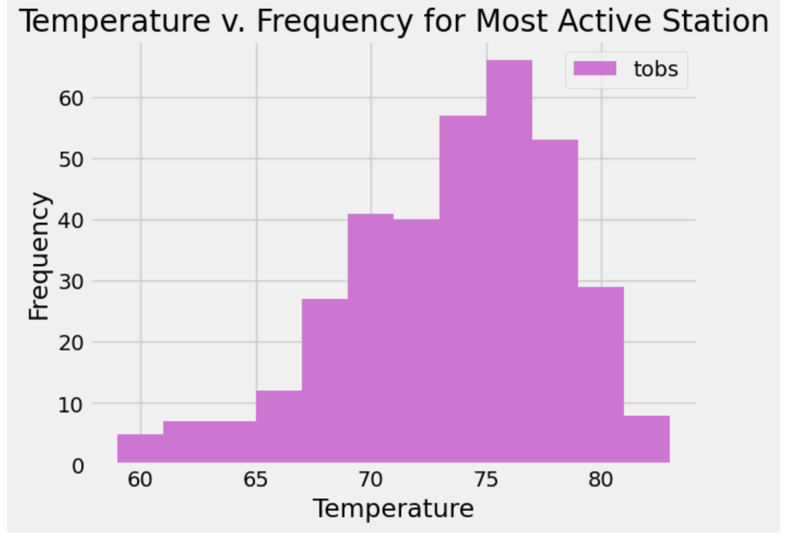

# hawaii-vacation--sqlalchemy

**About this Project**

- This project includes a 2 part analysis designed to help vacationers plan for weather when traveling to Hawaii! The analyses are contained in the folder called "SurfsUp"

- Part 1 uses Jupyter notebook and SQLAlchemy (refer to the climate.ipynb file in the SurfsUp folder). 

- Part 2 designs a Climate app in the form of a Flask API based on the initial analysis(refer to the app.py file in the SurfsUp folder).

**Part One:  Analyze and Explore the Climate Data**
**Objectives**:

*Precipitation Analysis Includes:*

- A query that finds the most recent date in the dataset (8/23/2017)

- A query that collects only the date and precipitation for the last year of data without passing the date as a variable 

- Saves the query results to a Pandas DataFrame to create date and precipitation columns sorted by date

- Plots the results by using the DataFrame plot method with date as the x and precipitation as the y variables and calculates summary statistics using Pandas

*Station Analysis Includes:*

- A query that correctly finds the number of stations in the dataset (9)

- A query that correctly lists the stations and observation counts in descending order and finds the most active station (USC00519281)

- A query that correctly finds the min, max, and average temperatures for the most active station (USC00519281)

- A query to get the previous 12 months of temperature observation (TOBS) data that filters by the station that has the greatest number of observations

- Saves the query results to a Pandas DataFrame and plots it as a histogram with bins=12 for the last year of data using tobs as the column count

**Part Two: Climate App**

*The Climate App Includes:*

- All available routes starting at the homepage.

- All queries returned in JSON representation/list

- Static routes (precipitation, stations, and tobs)

- Dynamic routes (start route and start/end route)

- The query results of the precipitation analysis (last year of precipitation) converted to a dictionary using date as the key and prcp as the value.

- List of stations from data set

- Query results of the dates and temperature observations of the most-active station for the previous year of data.

-  A JSON list of the minimum temperature, the average temperature, and the maximum temperature for a specified start AND start-end range.

